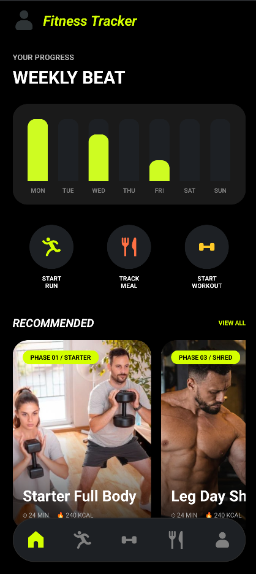
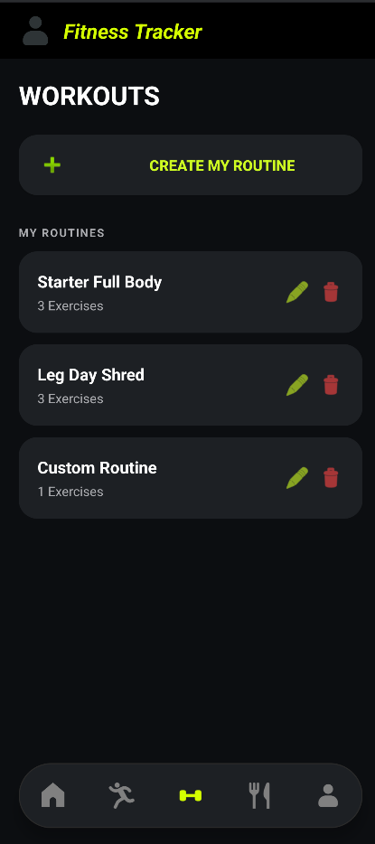
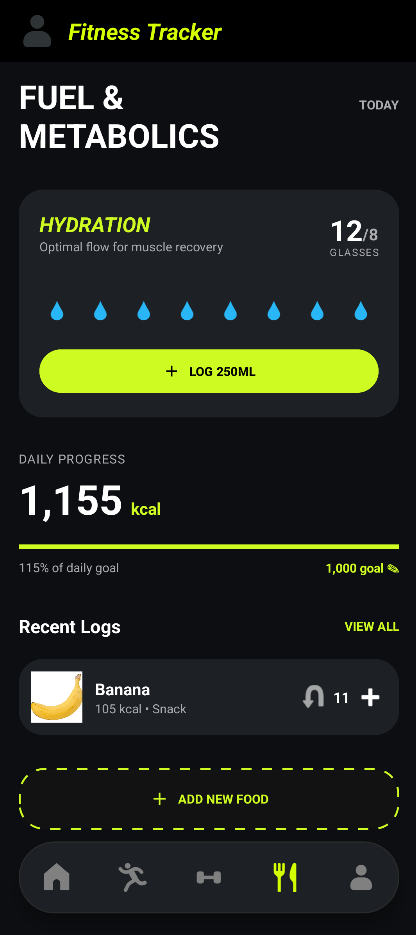
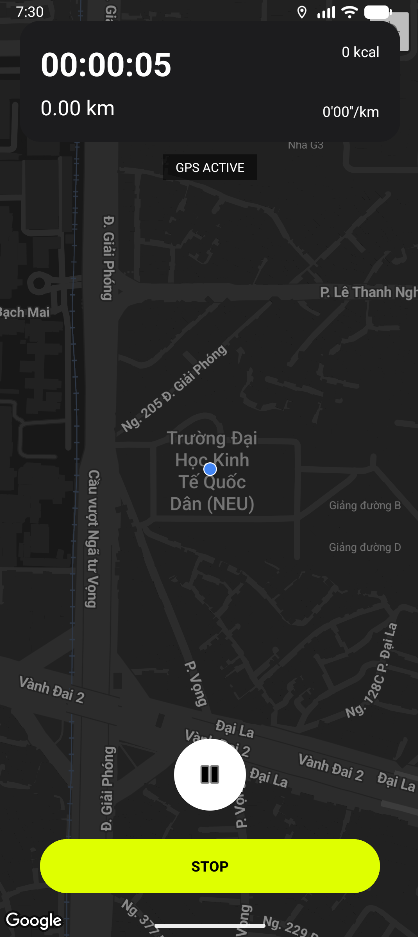
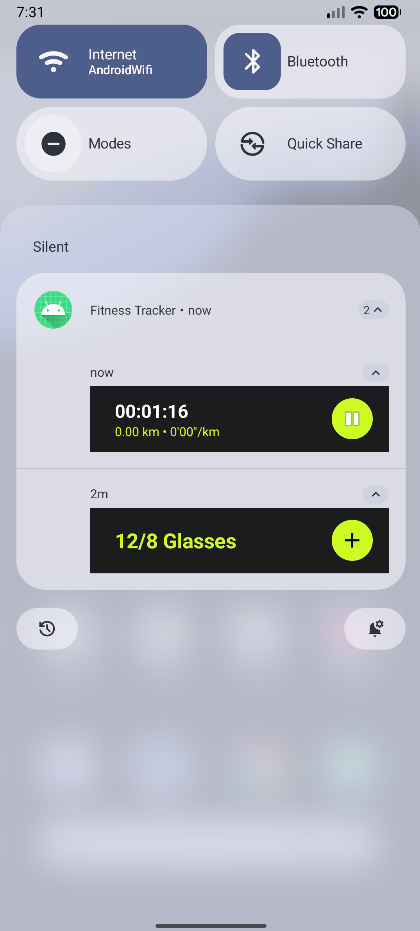

# Fitness Tracker

**Fitness Tracker** là một ứng dụng di động Android toàn diện, được thiết kế để giúp người dùng theo dõi và cải thiện sức khỏe qua 3 trụ cột chính: Tập luyện sức mạnh (Workout), Tim mạch (Cardio/Running), và Dinh dưỡng (Nutrition & Hydration). 

Được xây dựng với triết lý "Offline-first" và giao diện Dark Theme hiện đại, Fitness Tracker mang đến trải nghiệm mượt mà, trực quan ngay cả khi không có kết nối mạng.

---

## Các Tính Năng Chính

* **Quản Lý Bài Tập (Workout Tracker):** 
  * Tự tạo và chỉnh sửa lịch tập (Routine) tùy chỉnh với số Set, Rep và thời gian nghỉ.
  * Tự động tính toán lượng Calorie tiêu thụ (dựa trên METs và cân nặng thực tế).
* **Theo Dõi Chạy Bộ (Run Tracker):**
  * Tích hợp GPS theo thời gian thực để đếm khoảng cách, tính toán Pace (tốc độ).
  * Vẽ lộ trình chạy trực tiếp trên Google Maps.
  * Màn hình tóm tắt phiên chạy (Run Summary) với các thông số chi tiết.
* **Dinh Dưỡng & Nước (Nutrition & Hydration):**
  * Ghi nhận nhật ký ăn uống và tính toán lượng Calorie nạp vào so với mục tiêu trong ngày.
  * **Interactive Notification Widget:** Tính năng nhắc nhở và cho phép thêm lượng nước uống trực tiếp từ thanh thông báo (Lock Screen / Notification Tray) mà không cần mở ứng dụng.
* **Cá Nhân Hóa (Profile):**
  * Quản lý thông tin cơ thể (cân nặng, chiều cao) để hệ thống tự động đồng bộ và tính toán năng lượng tiêu hao chính xác nhất.

---

## Ảnh Chụp Màn Hình

| Trang Chủ (Home Dashboard) | Các Bài Tập (Workout Routine) | Dinh Dưỡng (Nutrition) |
|:---:|:---:|:---:|
|  |  |  |

 

| Theo Dõi Chạy Bộ (Run Tracking) | Interactive Notifications (Water & Run) |
|:---:|:---:|
|  |  |

---

## Công Nghệ Sử Dụng

* **Ngôn ngữ:** Java
* **UI/UX:** XML, ConstraintLayout, Material Components (Dark Theme, Custom Bottom Navigation).
* **Local Database:** Room Persistence Library (SQLite wrapper).
* **Background Tasks:** WorkManager (đặt lịch nhắc nhở), BroadcastReceiver, Thread/ExecutorService.
* **Bản đồ & Định vị:** Google Maps SDK, FusedLocationProviderClient (Google Play Services).
* **Kiến trúc:** Offline-first Architecture.